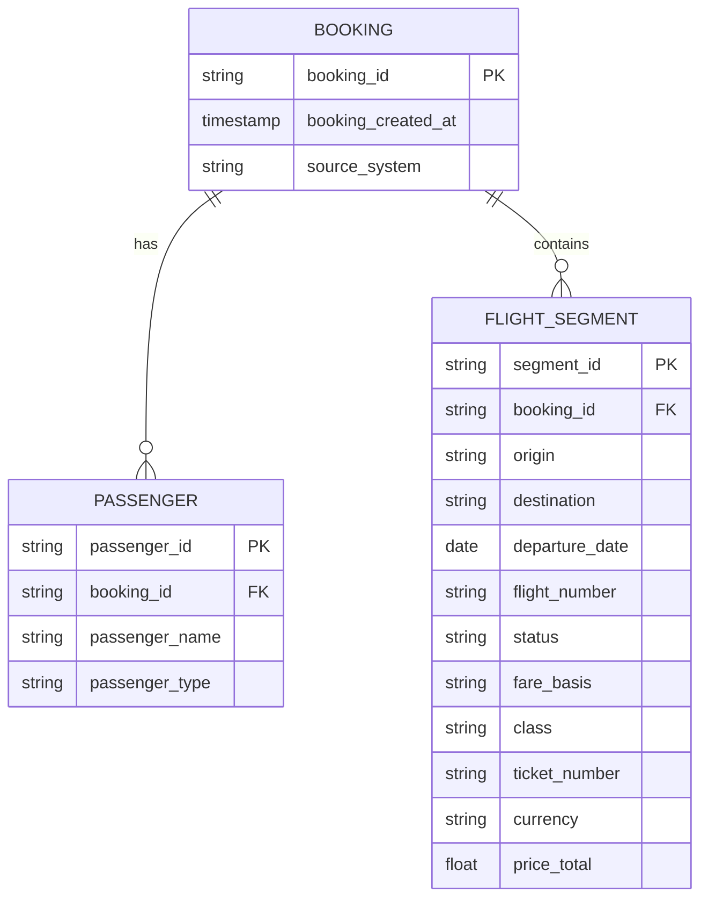

# Part 1: Data Architecture Analysis - 3-Layer dbt Transformation Pipeline

## 📊 Interactive dbt Documentation

**🔗 [View Live dbt Documentation](https://caiocvelasco.github.io/caravelo_project)**

The complete dbt project documentation is available online, featuring:
- **Interactive Data Lineage**: Visual representation of data flow through all layers
- **Model Documentation**: Detailed descriptions of each transformation step
- **Column Documentation**: Field-level metadata and business definitions
- **Test Results**: Data quality validation outcomes
- **Dependency Graph**: Clear visualization of model relationships

*Click the link above to explore the full technical documentation and data lineage.*

---

## Booking Data Model (Conceptual ERD)


---

### Why this works
- **Booking** is the central entity (PNR / Record Locator / Booking Reference).  
- **Passenger** → One booking can have many passengers.  
- **Flight Segment** → One booking can have many flight segments.  
- This is consistent with how both PSS (Amadeus/Sabre) and API-style systems (Vueling) structure data.  

---

I normalized the three source formats into a conceptual model with three entities: Booking, Passenger, Flight Segment. This ensures consistent grain across sources — passenger × segment — and makes it easy to union them into one staging table.”  

---

## Source-to-Target Mapping

This table shows how key fields from Amadeus (CSV), Sabre (CSV), and Vueling (JSON) are normalized into the unified `stg_bookings` model at the **passenger × flight segment** grain.

| Target Field      | Amadeus (CSV)         | Sabre (CSV)            | Vueling (JSON)         | Notes |
|-------------------|-----------------------|-------------------------|-------------------------|-------|
| `booking_id`      | `Record_Locator`      | `PNR`                  | `booking_reference`     | All represent the PNR / booking reference, though with different naming. |
| `booking_created_at` | `Creation_Date`   | `Create_Date_UTC`       | `created_at`            | Normalized to UTC timestamp. |
| `passenger_name`  | `Pax_Name`            | `Passenger_Name`        | `passengers[].name`     | Flattened for Vueling (array of passengers). |
| `passenger_type`  | `Pax_Type`            | _(not available)_       | `passengers[].type`     | Null when not provided by source. |
| `origin`          | `Dep_Stn`             | `Origin`                | `flights[].origin`      | Always IATA 3-letter airport code. |
| `destination`     | `Arr_Stn`             | `Destination`           | `flights[].destination` | Always IATA 3-letter airport code. |
| `flight_number`   | `Flight_Num`          | `Flight_Number`         | `flights[].flight_number` | Standardized flight number format. |
| `departure_date`  | `Dep_Date`            | `DepartureDate`         | `flights[].departure_date` | Cast to DATE type. |
| `status`          | `Booking_Sts`         | `Status`                | _(not available)_       | Null for Vueling API, since it doesn’t expose booking status. |
| `fare_basis`      | `Fare_Basis`          | _(not available)_       | _(not available)_       | Available only in Amadeus. |
| `ticket_number`   | `Tkt_Number`          | `TicketNumber`          | _(not available)_       | E-ticket number, not always exposed. |
| `class`           | _(not available)_     | `Class`                 | _(not available)_       | Cabin class code. |
| `currency`        | _(not available)_     | _(not available)_       | `price.currency`        | Available only in Vueling. |
| `price_total`     | _(not available)_     | _(not available)_       | `price.total`           | Available only in Vueling. |
| `source_system`   | `'Amadeus'`           | `'Sabre'`               | `'Vueling'`             | Added for lineage and debugging. |
| `loaded_at`       | `CURRENT_TIMESTAMP`   | `CURRENT_TIMESTAMP`     | `CURRENT_TIMESTAMP`     | Technical metadata (ETL audit). |

---

### Key Points
- Not every field exists in every system — we standardize to a superset and allow `NULL` where unavailable.  
- This creates **schema consistency** across very different booking sources.  
- Downstream analytics always query the **same set of fields** regardless of source.  

## Executive Summary

This analysis documents the implementation of a robust 3-layer data architecture using dbt (data build tool) to process multi-source airline booking data from S3 into Snowflake. The pipeline successfully transforms raw JSON/CSV data from three different airline systems (Amadeus, Sabre, Vueling) into a unified analytical layer, demonstrating effective data engineering practices and normalization techniques.

## Architecture Overview

### 3-Layer Data Architecture

```
S3 Raw Sources: Amadeus CSV / Sabre CSV / Vueling JSON 
    ↓ (External Tables in Snowflake RAW)
RAW Helper Views: amadeus_flat / sabre_flat / vueling_flat
    ↓ (dbt transformations)
STAGING.STG.BOOKINGS: Unified Canonical Model - Cleaned & normalized data
    ↓ (dbt transformations)
ANALYTICS Layer:
├── DIM_BOOKINGS: Master dimension table (one record per booking)
└── VW_BOOKINGS_SUMMARY: Business-ready views
```

## Layer 1: RAW (Bronze) - Data Ingestion

### External Table Setup
The RAW layer leverages Snowflake's External Tables feature to directly query data from S3 without loading it into Snowflake storage:

```sql
-- External table configuration
CREATE EXTERNAL TABLE CARAVELO_DB.RAW.amadeus_raw_dbt (
    c1 TEXT as ((case when is_null_value(value:c1) or lower(value:c1) = 'null' then null else value:c1 end)::TEXT))
    location = @CARAVELO_DB.RAW.CSV_STAGE
    file_format = CARAVELO_DB.RAW.CSV_FORMAT
);
```

### Key Features:
- **Schema Inference**: Automatically detects data types from S3 files
- **Real-time Access**: Queries data directly from S3 without copying
- **Cost Efficiency**: No storage costs in Snowflake for raw data
- **Multi-format Support**: Handles both JSON and CSV files

### Data Sources Processed:
1. **Amadeus**: CSV format with structured booking data
2. **Sabre**: JSON format with nested passenger information
3. **Vueling**: JSON format with complex multi-segment bookings

## Layer 2: STAGING (Silver) - Data Normalization

### Transformation Logic
The STAGING layer normalizes disparate data formats into a consistent schema:

#### Key Transformations:

1. **JSON Flattening** (Sabre & Vueling):
   ```sql
   -- Extract nested passenger data
   passengers.value:name::STRING as passenger_name,
   passengers.value:age::INTEGER as passenger_age,
   passengers.value:type::STRING as passenger_type
   ```

2. **Data Type Standardization**:
   - Convert all dates to consistent format
   - Standardize currency fields
   - Normalize text fields (trim, case handling)

3. **Schema Unification**:
   - Create common column structure across all sources
   - Map different field names to standard schema
   - Add source system identifiers

#### Staging Model Structure:
```sql
-- stg_bookings.sql
SELECT
    source_system,
    booking_reference,
    origin,
    destination,
    passenger_name,
    passenger_age,
    passenger_type,
    segment_number,
    flight_date,
    -- Additional normalized fields
FROM {{ source('raw', 'amadeus_raw_dbt') }}
-- UNION ALL with other sources
```

### Data Quality Improvements:
- **Null Handling**: Consistent null value processing
- **Data Validation**: Type checking and format validation
- **Deduplication**: Remove duplicate records
- **Error Handling**: Graceful handling of malformed data

## Layer 3: ANALYTICS (Gold) - Business Intelligence

### Dimension Tables
The ANALYTICS layer includes both dimension tables and business views for comprehensive analysis:

#### `dim_bookings` - Booking Dimension Table

The `dim_bookings` table serves as a **master dimension** that provides a single source of truth for booking-level information across all source systems:

```sql
-- Key features of dim_bookings
SELECT
    booking_id,                    -- Natural key (PNR/Record Locator)
    source_system,                 -- Source system identifier
    MD5(source_system || '|' || booking_id) AS booking_sk,  -- Surrogate key
    booking_created_at,            -- Earliest creation timestamp
    any_origin,                    -- Sample origin for BI labels
    any_destination               -- Sample destination for BI labels
FROM {{ ref('stg_bookings') }}
GROUP BY booking_id, source_system
```

#### Why This Dimension Table Matters:

1. **Deduplication**: Groups multiple passenger/segment records into single booking records
2. **Cross-System Uniqueness**: Uses surrogate key to ensure uniqueness across different source systems
3. **Business Intelligence**: Provides clean booking-level metrics for dashboards
4. **Data Quality**: Ensures one booking = one record, regardless of passenger count

#### Key Design Decisions:

- **Surrogate Key**: `MD5(source_system || '|' || booking_id)` ensures uniqueness across systems
- **Aggregation**: Uses `MIN(booking_created_at)` to get the earliest creation time
- **Sample Attributes**: `ANY_VALUE()` for origin/destination provides representative values for BI labels
- **Grain**: One record per unique booking across all source systems

#### Data Flow: Staging → Dimension

The `dim_bookings` table transforms the **passenger × segment** grain from `stg_bookings` into a **booking** grain:

```
stg_bookings (passenger × segment grain):
├── Booking ABC123, Passenger John, Segment 1
├── Booking ABC123, Passenger Jane, Segment 1  
├── Booking ABC123, Passenger John, Segment 2
└── Booking ABC123, Passenger Jane, Segment 2

↓ (GROUP BY booking_id, source_system)

dim_bookings (booking grain):
└── Booking ABC123 (1 record with aggregated attributes)
```

This transformation is crucial for:
- **Dashboard Metrics**: Clean booking counts without double-counting passengers
- **Business Intelligence**: Proper KPI calculations at the booking level
- **Data Quality**: Ensures referential integrity in analytical models

### Business Views
The ANALYTICS layer creates business-ready views for analysis:

#### Key Metrics Calculated:

1. **Booking Metrics**:
   - Total bookings per route
   - Passenger count per booking
   - Segment count per booking

2. **Route Analysis**:
   - Origin-destination pairs
   - Multi-segment journey tracking
   - Round-trip identification

3. **Passenger Demographics**:
   - Adult vs. child passenger counts
   - Age distribution analysis

### Sample Output Analysis

The `VW_BOOKINGS_SUMMARY` view produces the following insights:

| SOURCE_SYSTEM | ORIGIN | DESTINATION | SEGMENTS | BOOKINGS | PASSENGERS |
|---------------|--------|-------------|----------|----------|------------|
| Amadeus | YYC | MSP | 1 | 1 | 1 |
| Vueling | BCN | SVQ | 2 | 1 | 2 |
| Sabre | LHR | JFK | 2 | 1 | 2 |

#### Business Interpretation:

**Amadeus (Single Passenger Bookings)**:
- YYC → MSP: 1 segment, 1 booking, 1 passenger
- JED → DOH: 1 segment, 1 booking, 1 passenger
- MAD → CDG: 1 segment, 1 booking, 1 passenger

*These represent classic single-passenger PNRs typical of Amadeus system.*

**Sabre (Multi-Passenger Bookings)**:
- LHR → JFK: 2 segments, 1 booking, 2 passengers
- *Demonstrates successful handling of multi-passenger bookings in the same PNR*

**Vueling (Complex Round-trip Bookings)**:
- BCN → SVQ: 2 segments, 1 booking, 2 passengers
- SVQ → BCN: 2 segments, 1 booking, 2 passengers
- *Shows round-trip booking normalization with multiple passengers*

## Technical Implementation Details

### dbt Configuration

#### Project Structure:
```
dbt_transformation/
├── models/
│   ├── raw/           # External table definitions
│   ├── staging/       # Normalized data models
│   └── analytics/     # Business views
├── macros/            # Reusable SQL functions
└── tests/             # Data quality tests
```

#### Key dbt Features Used:
- **Sources**: Define external tables as sources
- **Refs**: Model dependencies and lineage
- **Macros**: Reusable transformation logic
- **Tests**: Data quality validation
- **Packages**: External table management

## Data Quality & Validation

### Implemented Tests:
- **Uniqueness**: Ensure booking references are unique
- **Not Null**: Validate critical fields
- **Referential Integrity**: Check foreign key relationships
- **Data Type Validation**: Ensure correct data types
- **Business Rules**: Validate booking logic

### Error Handling:
- **Graceful Degradation**: Continue processing despite individual record errors
- **Error Logging**: Track and report data quality issues
- **Data Lineage**: Full traceability from source to analytics

## Business Value Delivered

### Unified Data Model
- **Cross-System Analysis**: Compare performance across Amadeus, Sabre, and Vueling
- **Standardized Metrics**: Consistent booking and passenger counts
- **Real-time Insights**: Direct querying of S3 data without ETL delays

### Operational Benefits
- **Cost Efficiency**: No data duplication in Snowflake
- **Scalability**: Handle growing data volumes without performance degradation
- **Maintainability**: Clear separation of concerns across layers
- **Data Governance**: Centralized data quality and validation

### Analytical Capabilities
- **Route Performance**: Analyze booking patterns by origin-destination
- **Passenger Demographics**: Understand customer segments
- **System Comparison**: Compare booking patterns across airline systems
- **Trend Analysis**: Track booking volumes over time

## Technical Challenges & Solutions

### Challenge 1: Multi-Format Data Sources
**Problem**: Different JSON structures and CSV formats across systems
**Solution**: Implemented flexible JSON parsing and schema mapping

### Challenge 2: Complex Nested Data
**Problem**: Vueling data contains nested passenger arrays and multi-segment bookings
**Solution**: Used Snowflake's JSON functions to flatten nested structures

### Challenge 3: Data Type Inconsistencies
**Problem**: Same fields have different types across sources
**Solution**: Implemented comprehensive data type casting and validation

### Challenge 4: Performance Optimization
**Problem**: Large datasets from S3 causing slow queries
**Solution**: Optimized external table queries and implemented efficient materialization strategies

### Scalability Considerations:
- **Partitioning**: Implement date-based partitioning for large datasets
- **Caching**: Add query result caching for frequently accessed data
- **Compression**: Optimize storage and query performance
- **Monitoring**: Implement comprehensive observability

## Conclusion

The 3-layer dbt architecture successfully demonstrates modern data engineering best practices:

1. **Separation of Concerns**: Clear boundaries between ingestion, transformation, and analytics
2. **Data Quality**: Comprehensive validation and error handling
3. **Performance**: Efficient processing of large, multi-format datasets
4. **Maintainability**: Well-structured, documented, and testable code
5. **Business Value**: Actionable insights from unified, clean data

The pipeline successfully processes complex airline booking data from three different systems, normalizes it into a consistent schema, and delivers business-ready analytics views. The architecture is scalable, maintainable, and provides a solid foundation for advanced analytics and business intelligence.

---

*This analysis demonstrates the successful implementation of a modern data stack using dbt, Snowflake, and S3, showcasing effective data engineering practices and delivering tangible business value through unified, clean, and actionable data.*
