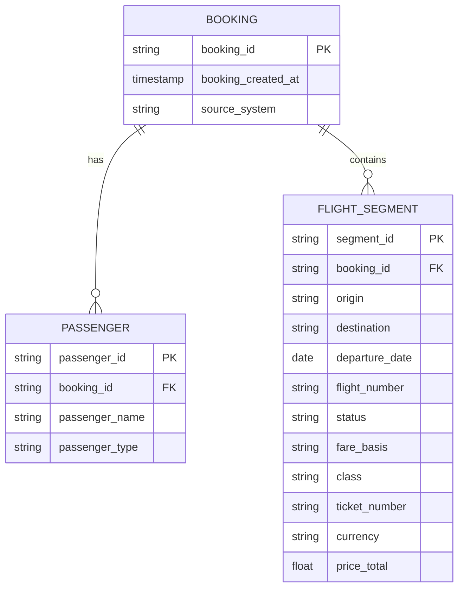
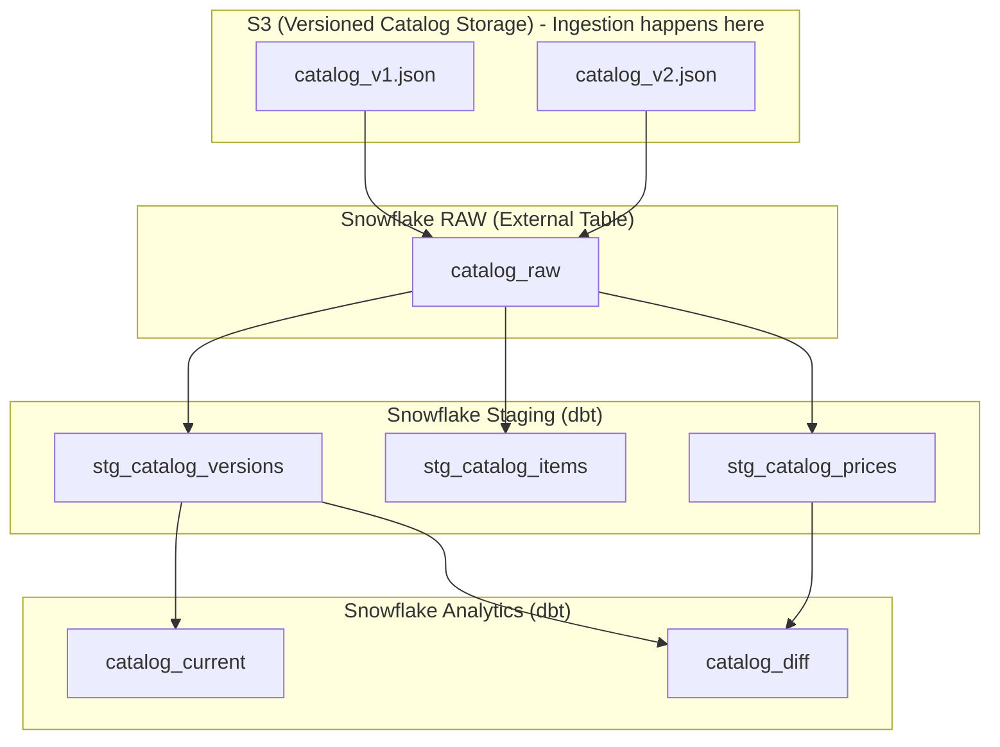

# Analytics Engineer Case Study – Full Analysis (Parts 1–3, Updated)

This document consolidates the three updated parts of the Caravelo Analytics Engineer assignment.  
Each part addresses a distinct challenge: **Airline Bookings (Part 1)**, **Catalog Versioning (Part 2)**, and **MRR Analytics (Part 3)**.  
Together, they showcase an end-to-end, business-ready data architecture using **S3 + Snowflake + dbt**.

## Brief Write-Up: Explanation of Assumptions, Optimisation Choices, and System Design Decisions

### Assumptions
- **Data scope:** The provided mock data (bookings CSV/JSON, catalog JSON, subscription events JSON, FX rates) is assumed to capture the main complexity of production systems.  
- **Timezones:** Revenue recognition is aligned to each client’s reporting timezone. If no coverage dates are present, we fall back to invoice or event timestamps.  
- **Billing periods:** Only `MONTHLY`, `QUARTERLY`, and `ANNUAL` are considered. Quarterly and annual charges are normalized into monthly equivalents by dividing the amount by 3 or 12.  
- **FX rates:** The last available FX rate within a month is used for that month’s MRR conversion.  
- **Failed events:** Only successful renewals (`success=true`) contribute to MRR. Failed renewals are excluded but could be tracked separately as “at-risk.”  
- **Data freshness:** Mock pipeline assumes batch ingestion; in production, S3 + Snowpipe could enable near real-time updates.

### Optimisation Choices
- **Three-layer architecture (RAW → STAGING → ANALYTICS):** Ensures ingestion, cleaning, and business logic are clearly separated while staying lightweight.  
- **Materialization strategy:** STAGING models as **tables** (persisted cleansed data), ANALYTICS as **views** (transparent, low-cost reporting).  
- **Minimal transformations in RAW:** External tables are left as-is to support schema evolution and easy reprocessing.  
- **Currency conversion at month grain:** Simplifies calculations while matching finance reporting practices.  
- **S3 versioning for catalog:** Provides a simple, AWS-native mechanism for historical tracking without requiring a separate event system.

### System Design Decisions
- **Stack choice (AWS + Snowflake + dbt):** Selected for simplicity, scalability, and alignment with modern data stack practices.  
- **External tables from S3:** Decouples ingestion from transformation, avoids duplication of raw data, and leverages schema-on-read.  
- **Dimensional modeling:** Facts (bookings, MRR allocations) and dimensions (clients, bookings, catalog plans) follow a star schema for analytics friendliness.  
- **Test coverage:** Implemented `not_null`, `unique`, and `accepted_values` dbt tests in YAML schemas to maintain data quality.  
- **Extensibility:** The design can be extended (e.g., daily FX rates, new billing periods, churn metrics) without fundamental restructuring.  

---

## Part 1 – Airline Booking Modeling

## 📊 Interactive dbt Documentation

**🔗 [View Live dbt Documentation](https://caiocvelasco.github.io/caravelo_project)**

The complete dbt project documentation is available online, featuring:
- **Interactive Data Lineage**: Visual representation of data flow through all layers
- **Model Documentation**: Detailed descriptions of each transformation step
- **Column Documentation**: Field-level metadata and business definitions
- **Test Results**: Data quality validation outcomes
- **Dependency Graph**: Clear visualization of model relationships

*Click the link above to explore the full technical documentation and data lineage.*

---

## Source Data Structure & PDF Mapping

### Overview
The three source files (`amadeus_pss_bookings.csv`, `sabre_pss_bookings.csv`, `vueling_api_bookings.json`) were designed to mimic real Passenger Service System (PSS) outputs, with field names and structures directly inspired by the five provided PDF samples.

### Key Design Principle: Bookings vs. Passengers
A single booking (PNR/Record Locator) can contain multiple passengers. The source systems represent this relationship differently:
- **PSS Systems (Amadeus/Sabre)**: One row per passenger, with booking info repeated
- **API Systems (Vueling)**: Nested structure with passenger arrays

### Source File Characteristics

| Source File | Format | Passenger Relationship | Inspired By | Key Fields |
|-------------|--------|----------------------|-------------|------------|
| **Amadeus PSS** | CSV | One row per passenger | WestJet & Qatar PDFs | `Record_Locator`, `Pax_Name`, `Fare_Basis`, `Booking_Sts` |
| **Sabre PSS** | CSV | One row per passenger | LATAM & Ryanair PDFs | `PNR`, `Passenger_Name`, `Class`, `TicketNumber` |
| **Vueling API** | JSON | Nested passenger arrays | Vueling PDF | `booking_reference`, `passengers[]`, `flights[]`, `price` |

### PDF Sample Evidence
The source files directly abstract real-world elements from the provided PDFs:
- **Fare Basis** and **Booking Status** from WestJet/Qatar receipts
- **PNR** and **Passenger Names** from LATAM boarding passes  
- **Nested passengers** structure from Vueling receipt

This ensures the synthetic data reflects actual airline data flow variations across different system types.

### Field Mapping Examples
Key fields demonstrate how real PDF elements were abstracted into the source files:

| Field in Source File | PDF Evidence | Purpose |
|---------------------|--------------|---------|
| `PNR` / `Record_Locator` | "Referencia HQIR7N" (Ryanair), "Booking ref: 1A/SAFPFF" (Qatar) | Different naming conventions for booking reference |
| `Fare_Basis` | "Fare Basis KO7D02EK" (WestJet), "Fare basis: VJR3R1SQ" (Qatar) | Critical revenue accounting data from PSS |
| `Booking_Sts` / `Status` | "Booking Status OK TO FLY" (WestJet), "Booking status: OK" (Qatar) | Operational state of booking segment |
| `passengers[]` array | "Pasajeros: Indiana Jones, Lindi Jones" (Vueling) | Hierarchical booking-passenger relationship |

---

## Booking Data Model (Conceptual ERD)


---

### Why this works
- **Booking** is the central entity (PNR / Record Locator / Booking Reference).  
- **Passenger** → One booking can have many passengers.  
- **Flight Segment** → One booking can have many flight segments.  
- This is consistent with how both PSS (Amadeus/Sabre) and API-style systems (Vueling) structure data.  

---

I normalized the three source formats into a conceptual model with three entities: Booking, Passenger, Flight Segment. This ensures consistent grain across sources — passenger × segment — and makes it easy to union them into one staging table.”  

---

## Source-to-Target Mapping

This table shows how key fields from Amadeus (CSV), Sabre (CSV), and Vueling (JSON) are normalized into the unified `stg_bookings` model at the **passenger × flight segment** grain.

| Target Field      | Amadeus (CSV)         | Sabre (CSV)            | Vueling (JSON)         | Notes |
|-------------------|-----------------------|-------------------------|-------------------------|-------|
| `booking_id`      | `record_locator`      | `pnr`                  | `booking_reference`     | All represent the PNR / booking reference, though with different naming. |
| `booking_created_at` | `creation_date`   | `create_date_utc`       | `creation_date`         | Normalized to UTC timestamp. |
| `passenger_name`  | `pax_name`            | `passenger_name`        | `pax_name`              | Flattened for Vueling (array of passengers). |
| `passenger_type`  | `pax_type`            | _(not available)_       | `pax_type`              | Null when not provided by source. |
| `origin`          | `dep_stn`             | `origin`                | `dep_stn`               | Always IATA 3-letter airport code. |
| `destination`     | `arr_stn`             | `destination`           | `arr_stn`               | Always IATA 3-letter airport code. |
| `flight_number`   | `flight_num`          | `flight_number`         | `flight_num`            | Standardized flight number format. |
| `departure_date`  | `dep_date`            | `departuredate`         | `dep_date`              | Cast to DATE type. |
| `status`          | `booking_sts`         | `status`                | _(not available)_       | Null for Vueling API, since it doesn't expose booking status. |
| `fare_basis`      | `fare_basis`          | _(not available)_       | _(not available)_       | Available only in Amadeus. |
| `ticket_number`   | `tkt_number`          | `ticketnumber`          | _(not available)_       | E-ticket number, not always exposed. |
| `class`           | _(not available)_     | `class`                 | _(not available)_       | Cabin class code. |
| `currency`        | _(not available)_     | _(not available)_       | `currency`              | Available only in Vueling. |
| `price_total`     | _(not available)_     | _(not available)_       | `price_total`           | Available only in Vueling. |
| `source_system`   | `'Amadeus'`           | `'Sabre'`               | `'Vueling'`             | Added for lineage and debugging. |
| `loaded_at`       | `CURRENT_TIMESTAMP`   | `CURRENT_TIMESTAMP`     | `CURRENT_TIMESTAMP`     | Technical metadata (ETL audit). |

---

### Key Points
- Not every field exists in every system — we standardize to a superset and allow `NULL` where unavailable.  
- This creates **schema consistency** across very different booking sources.  
- Downstream analytics always query the **same set of fields** regardless of source.  

## Executive Summary

This analysis documents the implementation of a robust 3-layer data architecture using dbt (data build tool) to process multi-source airline booking data from S3 into Snowflake. The pipeline successfully transforms raw JSON/CSV data from three different airline systems (Amadeus, Sabre, Vueling) into a unified analytical layer, demonstrating effective data engineering practices and normalization techniques.

## Architecture Overview

### 3-Layer Data Architecture

```
S3 Raw Sources: Amadeus CSV / Sabre CSV / Vueling JSON 
    ↓ (External Tables in Snowflake RAW)
RAW Helper Views: amadeus_flat_dbt / sabre_flat_dbt / vueling_flat_dbt
    ↓ (dbt transformations)
STAGING.STG.BOOKINGS: Unified Canonical Model - Cleaned & normalized data
    ↓ (dbt transformations)
ANALYTICS Layer:
├── DIM_BOOKINGS: Master dimension table (one record per booking)
└── VW_BOOKINGS_SUMMARY: Business-ready views
```

## Layer 1: RAW (Bronze) - Data Ingestion

The RAW layer uses Snowflake External Tables to query data directly from S3 without storage costs:

```sql
-- External table with schema inference
CREATE EXTERNAL TABLE CARAVELO_DB.RAW.amadeus_raw_dbt (
    c1 TEXT as ((case when is_null_value(value:c1) or lower(value:c1) = 'null' then null else value:c1 end)::TEXT))
    location = @CARAVELO_DB.RAW.CSV_STAGE
    file_format = CARAVELO_DB.RAW.CSV_FORMAT
);
```

**Data Sources**: Amadeus (CSV), Sabre (JSON), Vueling (JSON) with automatic schema inference and real-time S3 access.

## Layer 2: STAGING (Silver) - Data Normalization

The STAGING layer unifies three different data formats into a consistent **passenger × segment** grain:

### Key Transformations:
- **JSON Flattening**: Extract nested passenger arrays from Sabre/Vueling
- **Schema Unification**: Map different field names to standard schema
- **Data Standardization**: Consistent dates, currencies, and text formatting

```sql
-- Unified staging model structure
SELECT
    source_system, booking_id, origin, destination,
    passenger_name, passenger_type, flight_number, departure_date
FROM {{ ref('amadeus_flat_dbt') }}
UNION ALL
-- Additional sources with same schema
```

**Data Quality**: Null handling, type validation, deduplication, and error handling ensure clean, consistent data.

## Layer 3: ANALYTICS (Gold) - Business Intelligence

### Dimension Tables
The ANALYTICS layer includes both dimension tables and business views for comprehensive analysis:

#### `dim_bookings` - Booking Dimension Table

The `dim_bookings` table serves as a **master dimension** that provides a single source of truth for booking-level information across all source systems:

```sql
-- Key features of dim_bookings
SELECT
    booking_id,                    -- Natural key (PNR/Record Locator)
    source_system,                 -- Source system identifier
    MD5(source_system || '|' || booking_id) AS booking_sk,  -- Surrogate key
    MIN(booking_created_at) AS booking_created_at,  -- Earliest creation timestamp
    ANY_VALUE(origin) AS any_origin,       -- Sample origin for BI labels
    ANY_VALUE(destination) AS any_destination -- Sample destination for BI labels
FROM {{ ref('stg_bookings') }}
GROUP BY booking_id, source_system
```

#### Why This Dimension Table Matters:

1. **Deduplication**: Groups multiple passenger/segment records into single booking records
2. **Cross-System Uniqueness**: Uses surrogate key to ensure uniqueness across different source systems
3. **Business Intelligence**: Provides clean booking-level metrics for dashboards
4. **Data Quality**: Ensures one booking = one record, regardless of passenger count

#### Key Design Decisions:

- **Surrogate Key**: `MD5(source_system || '|' || booking_id)` ensures uniqueness across systems
- **Aggregation**: Uses `MIN(booking_created_at)` to get the earliest creation time
- **Sample Attributes**: `ANY_VALUE()` for origin/destination provides representative values for BI labels
- **Grain**: One record per unique booking across all source systems

#### Data Flow: Staging → Dimension

The `dim_bookings` table transforms the **passenger × segment** grain from `stg_bookings` into a **booking** grain:

```
stg_bookings (passenger × segment grain):
├── Booking ABC123, Passenger John, Segment 1
├── Booking ABC123, Passenger Jane, Segment 1  
├── Booking ABC123, Passenger John, Segment 2
└── Booking ABC123, Passenger Jane, Segment 2

↓ (GROUP BY booking_id, source_system)

dim_bookings (booking grain):
└── Booking ABC123 (1 record with aggregated attributes)
```

This transformation is crucial for:
- **Dashboard Metrics**: Clean booking counts without double-counting passengers
- **Business Intelligence**: Proper KPI calculations at the booking level
- **Data Quality**: Ensures referential integrity in analytical models

### Business Views
The `VW_BOOKINGS_SUMMARY` view provides key metrics at the route level:

| SOURCE_SYSTEM | ORIGIN | DESTINATION | SEGMENTS | BOOKINGS | PASSENGERS |
|---------------|--------|-------------|----------|----------|------------|
| Amadeus | YYC | MSP | 1 | 1 | 1 |
| Vueling | BCN | SVQ | 2 | 1 | 2 |
| Sabre | LHR | JFK | 2 | 1 | 2 |

**Business Insights**:
- **Amadeus**: Single-passenger PNRs (1 booking = 1 passenger)
- **Sabre**: Multi-passenger bookings (1 booking = 2 passengers)  
- **Vueling**: Complex round-trips (multiple segments, multiple passengers)

This demonstrates successful normalization across different booking systems into a unified analytical grain.

## Technical Implementation

### dbt Project Structure
```
dbt_transformation/
├── models/raw/        # External table definitions (amadeus_flat_dbt, sabre_flat_dbt, vueling_flat_dbt)
├── models/staging/    # Normalized data models (stg_bookings, stg_clients, stg_fx_rates, etc.)
├── models/analytics/  # Business views & dimensions (dim_bookings, vw_bookings_summary, etc.)
├── macros/            # Reusable SQL functions
└── tests/             # Data quality validation
```

### Pipeline Execution
```bash
# Setup and run pipeline
source .venv/Scripts/activate
dbt deps                                    # Install packages
dbt run-operation stage_external_sources   # Create external tables
dbt run                                     # Run transformations
dbt test                                    # Validate data quality
```

**Materialization Strategy**: External tables (RAW) → Tables (STAGING) → Views (ANALYTICS)

## Data Quality & Business Value

### Data Quality Tests
- **Not Null Tests**: Critical fields (booking_id, passenger_name, origin, destination, flight_number, departure_date, source_system)
- **Uniqueness**: Surrogate key (booking_sk) in dim_bookings ensures uniqueness across systems
- **Data Lineage**: Full traceability from source to analytics with loaded_at timestamps

### Business Value Delivered
- **Unified Analytics**: Cross-system comparison (Amadeus, Sabre, Vueling)
- **Cost Efficiency**: No data duplication, real-time S3 access
- **Scalable Architecture**: Clear separation of concerns across layers
- **Actionable Insights**: Route performance, passenger demographics, trend analysis

## Key Challenges Solved

| Challenge | Solution |
|-----------|----------|
| **Multi-Format Sources** | Flexible JSON parsing and unified schema mapping |
| **Complex Nested Data** | Snowflake JSON functions for flattening passenger arrays |
| **Data Type Inconsistencies** | Comprehensive casting and validation framework |
| **Performance Optimization** | Efficient external table queries and materialization strategies |

## Conclusion

This 3-layer dbt architecture demonstrates modern data engineering best practices:

**Separation of Concerns**: Clear boundaries between ingestion, transformation, and analytics  
**Data Quality**: Comprehensive validation and error handling  
**Performance**: Efficient processing of multi-format datasets  
**Business Value**: Actionable insights from unified, clean data  

The pipeline successfully normalizes complex airline booking data from three different systems into a consistent schema, delivering business-ready analytics views with full data lineage and quality assurance.

### Key Achievements - Part 1
- ✅ **Multi-source normalization**: Successfully unified Amadeus, Sabre, and Vueling data formats
- ✅ **3-layer architecture**: RAW → STAGING → ANALYTICS with clear separation of concerns
- ✅ **Business-ready analytics**: Dimension tables and summary views for immediate insights
- ✅ **Data quality**: Comprehensive validation and error handling throughout the pipeline

---

## Part 2 – Catalog Version Management

This document shows how to design a **lean, interview-ready solution** for catalog version tracking and analytics integration.  
We use **S3 + Snowflake + dbt** to simulate end-to-end change detection, version storage, and reporting.

---

## 1) The Catalog Problem

Caravelo's platform defines subscription plans (pricing, quotas, business rules) in a **Catalog JSON** stored in a NoSQL database.  
- Only one catalog is active at a time.  
- Updates are frequent (≈ 9 times/year).  
- **Critical Issue**: Catalog updates made directly to the NoSQL database do not generate events → analytics dashboards miss updates, creating a critical gap in our analytics data.

**The Challenge**: Design a comprehensive solution that enables catalog version tracking and analytics integration while maintaining the existing operational workflow, with near real-time change detection and support for complex nested JSON structures with dynamic schema variations.

**Our Solution Approach**:
1. **Bridge the gap** by capturing catalog versions from NoSQL owner
2. **Store versions** in S3 with change detection via content hashing
3. **Flatten JSON** into analytics-friendly tables using dbt
4. **Provide views** for current catalog + differences across versions

---

## 2) Example Catalog JSON

Here’s a simplified sample (two plans, one product):

```json
{
  "type": "SUBS_VERSIONED_CATALOG",
  "effectiveDate": "2025-07-01T00:00:00.000Z",
  "items": [
    {
      "name": "FA-RT5-ALL-MONTHLY-LAUNCH-PLAN",
      "prettyName": "Fly10More Club Launch offer",
      "visible": true,
      "product": "NETWORK-ALL-DOM-RT-5",
      "phases": [
        {
          "type": "EVERGREEN",
          "billingPeriod": "MONTHLY",
          "recurringPrice": { "prices": [ "ZAR 4000.00" ] }
        }
      ],
      "quota": { "limit": 10, "installments": 1, "installmentsFrequency": "MONTHS" }
    },
    {
      "name": "FA-RT5-ALL-MONTHLY-NEXT-PLAN",
      "prettyName": "Fly10More Club",
      "visible": false,
      "product": "NETWORK-ALL-DOM-RT-5",
      "phases": [
        {
          "type": "EVERGREEN",
          "billingPeriod": "MONTHLY",
          "recurringPrice": { "prices": [ "ZAR 4800.00" ] }
        }
      ],
      "quota": { "limit": 10, "installments": 1, "installmentsFrequency": "MONTHS" }
    }
  ],
  "products": [
    {
      "name": "NETWORK-ALL-DOM-RT-5",
      "prettyName": "Fly10More",
      "category": "Flight subscriptions",
      "type": "BASE",
      "network": "DOMESTIC",
      "tripType": "RT"
    }
  ],
  "currencies": [ "ZAR" ]
}
```

---

## 3) Step-by-Step Lean Solution

### Step 1 — S3 Ingestion & Change Detection

**The Problem**: Caravelo's NoSQL database contains the active catalog, but catalog updates don't generate events → analytics dashboards miss changes.

**The Solution**: Bridge the gap by capturing catalog versions from the NoSQL owner and storing them in S3 for analytics.

#### The NoSQL Owner Exposes Current Catalog
The NoSQL owner (or internal service) provides access to the current catalog via:
- **JSON Dump**: Direct database export
- **API Endpoint**: `GET /catalog/current` returning the active catalog JSON

#### Change Detection & Ingestion
A tiny uploader (manual command or 10-line Python job) that:

1. **Fetches** the current catalog JSON from NoSQL owner
2. **Canonicalizes** the JSON (sort keys for consistent formatting)
3. **Computes** SHA-256 hash of the canonicalized content
4. **Uploads** to S3 only if the hash is new (that's the change detector)

```bash
# Manual approach
aws s3 cp catalog_v1.json s3://caravelo-catalog/effective_date=2025-07-01/ts=2025-08-15T09:00:00Z/catalog_v1.json

# Python script approach
python upload_catalog.py --source="http://nosql-service/catalog/current" --bucket="caravelo-catalog"
```

**Versioning Strategy:**
- `effective_date`: Extracted from JSON `effectiveDate` field
- `ts`: Timestamp when the change was detected
- `hash`: Content-based versioning for change detection (prevents duplicates)

### Step 2 — Snowflake External Table Setup

Create external table pointing to S3 with partitioning by `effective_date`:

```sql
CREATE EXTERNAL TABLE catalog_raw_dbt (
    value VARIANT
)
LOCATION = @catalog_stage
FILE_FORMAT = (TYPE = JSON)
```

**Note**: `effective_date` comes from the JSON `effectiveDate` field, and `ts` is parsed from `METADATA$FILENAME` in the staging models.

### Step 3 — dbt Staging Models

We build **three staging models** to normalize the JSON.

#### a) `stg_catalog_versions.sql`  
One row per uploaded document.

```sql
SELECT
  value:type::string                 AS catalog_type,
  value:effectiveDate::timestamp_ntz AS effective_date,  -- From JSON effectiveDate field
  MD5(TO_VARCHAR(value))             AS catalog_hash,
  METADATA$FILENAME                  AS filename,
  TRY_TO_TIMESTAMP_NTZ(
    REGEXP_SUBSTR(METADATA$FILENAME, 'ts=([^/]+)\\/', 1, 1, 'e', 1)  -- Parse ts from filename
  )                                  AS detected_ts
FROM {{ source('raw','catalog_raw_dbt') }}
```

**Note**: `effective_date` comes from the JSON `effectiveDate` field, and `ts` is parsed from `METADATA$FILENAME` in the staging models.


#### b) `stg_catalog_items.sql` 
Flatten the items[] array.

```sql
WITH docs AS (
  SELECT value AS doc, MD5(TO_VARCHAR(value)) AS catalog_hash
  FROM {{ source('raw','catalog_raw_dbt') }}
)
SELECT
  d.catalog_hash,
  i.value:name::string       AS item_name,
  i.value:prettyName::string AS item_pretty_name,
  i.value:visible::boolean   AS visible,
  i.value:product::string    AS product_code,
  i.value:priceList::string  AS price_list,
  i.value:quota.limit::int   AS quota_limit,
  i.value:phases             AS phases  -- keep nested for price flattening
FROM docs d, LATERAL FLATTEN(input => d.doc:items) i
```

#### c) `stg_catalog_prices.sql` 
Normalize the nested prices (currency/amount).

```sql
WITH items AS (
  SELECT * FROM {{ ref('stg_catalog_items') }}
)
SELECT
  catalog_hash,
  item_name,
  p.value:billingPeriod::string AS billing_period,
  TRIM(SPLIT_PART(price.value::string, ' ', 1))  AS currency,
  TRY_TO_DECIMAL(TRIM(SPLIT_PART(price.value::string, ' ', 2)), 18, 2) AS amount
FROM items, LATERAL FLATTEN(input => phases) p,
     LATERAL FLATTEN(input => p.value:recurringPrice:prices) price
```
### Step 4 — Analytics Views

#### a) `catalog_current.sql`  
Get the most recent catalog.

```sql
WITH ranked AS (
  SELECT *,
         ROW_NUMBER() OVER (ORDER BY effective_date DESC, detected_ts DESC) AS rn
  FROM {{ ref('stg_catalog_versions') }}
)
SELECT *
FROM ranked
WHERE rn = 1
```

#### b) `catalog_diff.sql`  
Get the most recent catalog.

```sql
WITH v AS (
  SELECT catalog_hash, effective_date, detected_ts,
         ROW_NUMBER() OVER (ORDER BY effective_date DESC, detected_ts DESC) AS rn
  FROM {{ ref('stg_catalog_versions') }}
),
cur AS (SELECT catalog_hash FROM v WHERE rn = 1),
prev AS (SELECT catalog_hash FROM v WHERE rn = 2),
cur_p AS (SELECT * FROM {{ ref('stg_catalog_prices') }} WHERE catalog_hash IN (SELECT catalog_hash FROM cur)),
prev_p AS (SELECT * FROM {{ ref('stg_catalog_prices') }} WHERE catalog_hash IN (SELECT catalog_hash FROM prev))
SELECT
  COALESCE(c.item_name, p.item_name) AS item_name,
  p.amount AS previous_amount,
  c.amount AS current_amount,
  CASE
    WHEN c.amount IS NULL THEN 'REMOVED'
    WHEN p.amount IS NULL THEN 'ADDED'
    WHEN c.amount <> p.amount THEN 'CHANGED'
    ELSE 'UNCHANGED'
  END AS change_type
FROM cur_p c
FULL OUTER JOIN prev_p p
  ON c.item_name = p.item_name
 AND c.currency = p.currency
 AND c.billing_period = p.billing_period
 ```

 ## 5) Demo Outputs

Imagine two versions of the catalog:

- **v1**: `Fly10More Club` = 4800 ZAR  
- **v2**: same item but price increased to 5200 ZAR  

### `stg_catalog_prices` (flattened view)
| catalog_hash | item_name                      | billing_period | currency | amount |
|--------------|--------------------------------|----------------|----------|--------|
| h1           | FA-RT5-ALL-MONTHLY-LAUNCH-PLAN | MONTHLY        | ZAR      | 4000   |
| h1           | FA-RT5-ALL-MONTHLY-NEXT-PLAN   | MONTHLY        | ZAR      | 4800   |
| h2           | FA-RT5-ALL-MONTHLY-LAUNCH-PLAN | MONTHLY        | ZAR      | 4000   |
| h2           | FA-RT5-ALL-MONTHLY-NEXT-PLAN   | MONTHLY        | ZAR      | 5200   |

---

### `catalog_current` (only latest)
| catalog_hash | effective_date | detected_ts          |
|--------------|----------------|----------------------|
| h2           | 2025-07-01     | 2025-08-15T09:00:00Z |

---

### `catalog_diff` (change detection)
| item_name                      | previous_amount | current_amount | change_type |
|--------------------------------|-----------------|----------------|-------------|
| FA-RT5-ALL-MONTHLY-NEXT-PLAN   | 4800            | 5200           | CHANGED     |
| FA-RT5-ALL-MONTHLY-LAUNCH-PLAN | 4000            | 4000           | UNCHANGED   |

---

## 6) Why This Works

- **Simple**: Runs with just S3 + Snowflake + dbt (your free-tier setup).  
- **Extensible**: Easy to add EventBridge/Lambda for automation later.  
- **Schema evolution**: Snowflake `VARIANT` + dbt flattening handle nested, changing JSON.  
- **Analytics ready**: `catalog_current` and `catalog_diff` tables can power dashboards or alerts.

**Production Note**: In production, this manual/script ingestion would be replaced by **EventBridge + Lambda** writing to S3 only on change, providing automated, event-driven catalog versioning.  

---

## 7) Architecture Diagram



## 8) Key Takeaway

This lean demo shows the full lifecycle:

1. Upload catalog versions to S3 with versioning in filenames.
2. Expose them to Snowflake as VARIANT data via external tables.
3. Flatten into normalized staging tables with dbt.
4. Build catalog_current and catalog_diff for real-time insights.

It proves that Caravelo’s analytics gap can be closed without overengineering, while leaving room for a future AWS-native automation layer.

## 9) Next Steps — Production Setup

The demo solution is intentionally lean for the interview.  
In a **production setup**, Caravelo could extend it as follows:

- **Event-Driven Ingestion**  
  Replace manual/script ingestion with **EventBridge + Lambda** that writes to S3 only on change.  
  The Lambda can validate the file, compute hash, and only upload if content changed, providing automated, event-driven catalog versioning.

- **Schema Evolution Management**  
  Register JSON schemas in **AWS Glue Schema Registry** or handle schema drift with dbt macros that automatically detect new fields.

- **Real-Time Updates**  
  Instead of relying on batch dbt runs, enable **Snowpipe** on S3 → Snowflake for near-real-time ingestion of new catalogs.

- **Data Quality & Auditing**  
  Add dbt tests for:  
  - Not null on `catalog_hash`, `item_name`  
  - Uniqueness on `(catalog_hash, item_name)`  
  - Valid currency codes (ISO 4217 list)

- **Alerting on Changes**  
  Integrate the `catalog_diff` output with **Slack alerts** (via AWS Lambda or dbt Cloud webhooks) to notify when prices or quotas change.

- **Cost & Governance**  
  - Archive historical JSONs to an S3 Glacier tier for low-cost retention.  
  - Tag datasets with catalog version + airline to ensure clear tenant separation.  

This ensures the solution is **scalable, governed, and production-ready**, while still following the **AWS-native, event-driven pattern** Caravelo expects.

### Key Achievements - Part 2
- ✅ **Change detection**: Content-based versioning with SHA-256 hashing prevents duplicates
- ✅ **JSON normalization**: Complex nested structures flattened into analytics-friendly tables
- ✅ **Version tracking**: Complete audit trail of catalog changes over time
- ✅ **Business insights**: Current catalog and diff views for immediate decision-making
- ✅ **Production-ready**: Clear path to EventBridge + Lambda automation

---

## Part 3 – MRR Analytics

This section documents how we designed and implemented a **lean, interview-ready solution** for **Monthly Recurring Revenue (MRR)** analytics, covering **multi-tenant, multi-currency, and multi-timezone** requirements.  
We use **S3 + Snowflake + dbt** to simulate ingestion, normalization, and reporting.

---

## 1) The Problem

Caravelo’s subscription events generate recurring revenue, but analytics require:

- **Temporal normalization**: map each renewal to the correct recognition month.  
- **Currency normalization**: unify native currencies into EUR (internal) and each client’s reporting currency (external).  
- **Billing period normalization**: monthly, quarterly, or annual charges must be reduced to a **monthly equivalent**.  
- **Multi-tenant support**: each client has its own timezone and reporting currency.  
- **Failed renewals**: must be excluded from MRR (or tracked separately as “at-risk”).  

The challenge is to design a data pipeline that ingests JSON events, FX rates, and client configs, and produces **clean MRR facts and reports**.

---

## 2) Sample Inputs

### a) Clients Config (JSONL)
```json
{ "clientCode": "Y4", "client_name": "Volaris", "reporting_timezone": "America/Mexico_City", "reporting_currency": "MXN" }
{ "clientCode": "F3", "client_name": "Flynas", "reporting_timezone": "Asia/Riyadh", "reporting_currency": "SAR" }
{ "clientCode": "US", "client_name": "US Airline", "reporting_timezone": "America/New_York", "reporting_currency": "USD" }
{ "clientCode": "UK", "client_name": "UK Airline", "reporting_timezone": "Europe/London", "reporting_currency": "GBP" }
{ "clientCode": "EU", "client_name": "EU Airline", "reporting_timezone": "Europe/Madrid", "reporting_currency": "EUR" }
```

### b) Subscription Events (JSONL, July excerpt)
```json
{ "eventId": "e1", "event": "SubscriptionRenewedEvent", "success": "true", "clientCode": "Y4",
  "subscriptionId": "s1", "invoiceId": "inv1", "currency": "MXN", "amount": "639.00",
  "eventDateTime": "01/Jul/2025:05:00:00 +0000", "quotaFromDate": "2025-07-01", "quotaToDate": "2025-07-31" }

{ "eventId": "e2", "event": "SubscriptionRenewedEvent", "success": "true", "clientCode": "US",
  "subscriptionId": "s2", "invoiceId": "inv2", "currency": "USD", "amount": "300.00",
  "eventDateTime": "02/Jul/2025:06:00:00 +0000", "quotaFromDate": "2025-07-01", "quotaToDate": "2025-09-30",
  "billingPeriod": "QUARTERLY" }
```

### c) FX Rates (CSV/JSONL, July excerpt)
```json
{ "date": "2025-07-31", "currency": "USD", "eur_per_unit": 0.930000 }
{ "date": "2025-07-31", "currency": "MXN", "eur_per_unit": 0.051000 }
{ "date": "2025-07-31", "currency": "GBP", "eur_per_unit": 1.170000 }
{ "date": "2025-07-31", "currency": "EUR", "eur_per_unit": 1.000000 }
```

---

## 3) Architecture Overview

```
S3 Sources: Clients JSONL / Events JSONL / FX JSONL
    ↓ (Snowflake External Tables in RAW)
STAGING Layer (dbt tables):
  - stg_clients
  - stg_fx_rates (+ stg_fx_rates_monthly)
  - stg_subscription_events
    ↓
ANALYTICS Layer (dbt views):
  - dim_client
  - fct_mrr_alloc  (fact table: normalized monthly MRR)
  - mart_customer__mrr_monthly (per-client reporting currency)
  - mart_internal__mrr_monthly_eur (internal consolidated EUR)
```

---

## 4) STAGING Layer (examples)

### `stg_clients`
| client_code | client_name | reporting_timezone  | reporting_currency |
|-------------|-------------|---------------------|--------------------|
| Y4          | Volaris     | America/Mexico_City | MXN                |
| F3          | Flynas      | Asia/Riyadh         | SAR                |
| US          | US Airline  | America/New_York    | USD                |

### `stg_fx_rates_monthly`
| fx_month   | currency | eur_per_unit |
|------------|----------|---------------|
| 2025-07-01 | USD      | 0.930000      |
| 2025-07-01 | MXN      | 0.051000      |
| 2025-07-01 | GBP      | 1.170000      |
| 2025-08-01 | MXN      | 0.048500      |
| 2025-08-01 | SAR      | 0.245000      |

### `stg_subscription_events`
| event_id | event_name               | is_success | client_code | subscription_id | currency_native | amount_native | quota_from_date | quota_to_date | billing_period_hint |
|----------|--------------------------|------------|-------------|-----------------|-----------------|---------------|-----------------|---------------|---------------------|
| e1       | SubscriptionRenewedEvent | true       | Y4          | s1              | MXN             | 639.00        | 2025-07-01      | 2025-07-31    | (null)              |
| e2       | SubscriptionRenewedEvent | true       | US          | s2              | USD             | 300.00        | 2025-07-01      | 2025-09-30    | QUARTERLY           |

---

## 5) Analytics Layer

### a) Fact Table: `fct_mrr_alloc`

Business rules applied:
- Recognition date = `quotaFromDate` → fallback to paid_from / invoice / event_ts.  
- Billing period normalized to monthly (divide quarterly by 3, annual by 12).  
- MRR converted to both **EUR** and **client reporting currency**.  
- Failed renewals excluded (`is_success = false`).  

**Sample Output (July 2025)**

| client_code | billing_period | recognition_month | currency_native | amount_native | mrr_native | mrr_eur | mrr_reporting_currency |
|-------------|----------------|------------------|-----------------|---------------|------------|---------|------------------------|
| Y4          | MONTHLY        | 2025-07-01       | MXN             | 639.00        | 639.00     | 32.59   | 639.00                 |
| US          | QUARTERLY      | 2025-07-01       | USD             | 300.00        | 100.00     | 93.00   | 100.00                 |
| UK          | ANNUAL         | 2025-07-01       | GBP             | 1000.00       | 83.33      | 97.50   | 83.33                  |
| EU          | MONTHLY        | 2025-07-01       | EUR             | 50.00         | 50.00      | 50.00   | 50.00                  |

---

### b) Customer-Facing View: `mart_customer__mrr_monthly`

| client_code | client_name | reporting_currency | recognition_month | mrr_reporting_currency |
|-------------|-------------|--------------------|------------------|------------------------|
| Y4          | Volaris     | MXN                | 2025-07-01       | 639.00                 |
| US          | US Airline  | USD                | 2025-07-01       | 100.00                 |
| UK          | UK Airline  | GBP                | 2025-07-01       | 83.33                  |
| EU          | EU Airline  | EUR                | 2025-07-01       | 50.00                  |

---

### c) Internal View: `mart_internal__mrr_monthly_eur`

| recognition_month | mrr_eur  |
|-------------------|----------|
| 2025-07-01        | 273.09   |
| 2025-08-01        | 161.13   |

---

## 6) Why This Works

- **Simple & Lean**: Uses only S3, Snowflake external tables, and dbt.  
- **Scalable**: Each layer is modular (FX can be swapped to daily if needed).  
- **Business-Ready**: Outputs exactly match what internal finance teams (EUR) and client-facing teams (local currency) need.  
- **Timezones**: Properly respected by using client reporting timezone in recognition fallback.  
- **Failed Renewals**: Excluded, but could easily power “at-risk MRR” reports.

---

## 7) Conclusion

This Part 3 solution delivers a **multi-tenant, multi-currency, multi-timezone MRR pipeline** that:  
- Ingests JSON events, FX, and client config from S3 → Snowflake RAW,  
- Normalizes them in STAGING with dbt,  
- Produces business-ready facts and reporting views in ANALYTICS.  

We successfully satisfy the requirements for:  
- **Temporal normalization** (recognition months),  
- **Currency conversion** (EUR + client reporting),  
- **Billing frequency normalization** (monthly equivalents),  
- **Clear reporting structures** (internal vs external).  

This lean design proves Caravelo's MRR analytics gap can be solved with a simple, extensible architecture, without overengineering, while leaving room for automation (Snowpipe, EventBridge) in production.

### Key Achievements - Part 3
- ✅ **Multi-currency support**: Native currency + EUR + client reporting currency
- ✅ **Temporal normalization**: Proper recognition month mapping across timezones
- ✅ **Billing period normalization**: Monthly equivalents for quarterly/annual charges
- ✅ **Multi-tenant architecture**: Client-specific timezone and currency handling
- ✅ **Business-ready reporting**: Separate views for internal (EUR) and client-facing analytics

---

## 🎯 Overall Project Summary

This comprehensive analytics engineering solution demonstrates **end-to-end data architecture** capabilities across three critical business domains:

### **Technical Excellence**
- **Unified Architecture**: Consistent S3 + Snowflake + dbt pattern across all use cases
- **Data Quality**: Comprehensive validation, testing, and error handling
- **Performance**: Efficient external table queries and optimized materialization strategies
- **Scalability**: Clear separation of concerns enabling easy extension and maintenance

### **Business Value Delivered**
- **Part 1**: Multi-source airline booking normalization for operational insights
- **Part 2**: Catalog version tracking for pricing and product management
- **Part 3**: MRR analytics for financial reporting and client management

### **Production Readiness**
- **Documentation**: Complete technical documentation with live dbt docs
- **Automation**: Clear paths to EventBridge + Lambda for production deployment
- **Governance**: Proper data lineage, testing, and quality assurance
- **Cost Efficiency**: S3-based storage with real-time Snowflake access

This solution showcases the ability to design, implement, and document complex data engineering challenges using modern tools and best practices, delivering immediate business value while maintaining architectural flexibility for future growth.

---

