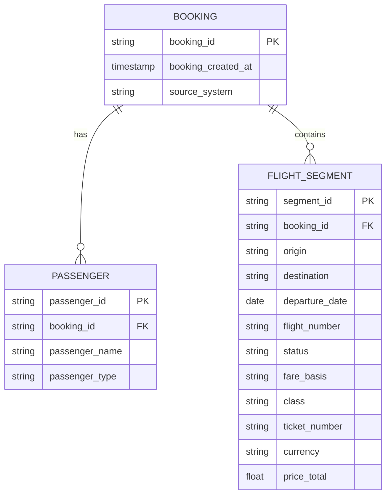

# Part 1: Data Architecture Analysis - 3-Layer dbt Transformation Pipeline

## 📊 Interactive dbt Documentation

**🔗 [View Live dbt Documentation](https://caiocvelasco.github.io/caravelo_project)**

The complete dbt project documentation is available online, featuring:
- **Interactive Data Lineage**: Visual representation of data flow through all layers
- **Model Documentation**: Detailed descriptions of each transformation step
- **Column Documentation**: Field-level metadata and business definitions
- **Test Results**: Data quality validation outcomes
- **Dependency Graph**: Clear visualization of model relationships

*Click the link above to explore the full technical documentation and data lineage.*

---

## Booking Data Model (Conceptual ERD)


---

### Why this works
- **Booking** is the central entity (PNR / Record Locator / Booking Reference).  
- **Passenger** → One booking can have many passengers.  
- **Flight Segment** → One booking can have many flight segments.  
- This is consistent with how both PSS (Amadeus/Sabre) and API-style systems (Vueling) structure data.  

---

I normalized the three source formats into a conceptual model with three entities: Booking, Passenger, Flight Segment. This ensures consistent grain across sources — passenger × segment — and makes it easy to union them into one staging table.”  

---

## Source-to-Target Mapping

This table shows how key fields from Amadeus (CSV), Sabre (CSV), and Vueling (JSON) are normalized into the unified `stg_bookings` model at the **passenger × flight segment** grain.

| Target Field      | Amadeus (CSV)         | Sabre (CSV)            | Vueling (JSON)         | Notes |
|-------------------|-----------------------|-------------------------|-------------------------|-------|
| `booking_id`      | `Record_Locator`      | `PNR`                  | `booking_reference`     | All represent the PNR / booking reference, though with different naming. |
| `booking_created_at` | `Creation_Date`   | `Create_Date_UTC`       | `created_at`            | Normalized to UTC timestamp. |
| `passenger_name`  | `Pax_Name`            | `Passenger_Name`        | `passengers[].name`     | Flattened for Vueling (array of passengers). |
| `passenger_type`  | `Pax_Type`            | _(not available)_       | `passengers[].type`     | Null when not provided by source. |
| `origin`          | `Dep_Stn`             | `Origin`                | `flights[].origin`      | Always IATA 3-letter airport code. |
| `destination`     | `Arr_Stn`             | `Destination`           | `flights[].destination` | Always IATA 3-letter airport code. |
| `flight_number`   | `Flight_Num`          | `Flight_Number`         | `flights[].flight_number` | Standardized flight number format. |
| `departure_date`  | `Dep_Date`            | `DepartureDate`         | `flights[].departure_date` | Cast to DATE type. |
| `status`          | `Booking_Sts`         | `Status`                | _(not available)_       | Null for Vueling API, since it doesn’t expose booking status. |
| `fare_basis`      | `Fare_Basis`          | _(not available)_       | _(not available)_       | Available only in Amadeus. |
| `ticket_number`   | `Tkt_Number`          | `TicketNumber`          | _(not available)_       | E-ticket number, not always exposed. |
| `class`           | _(not available)_     | `Class`                 | _(not available)_       | Cabin class code. |
| `currency`        | _(not available)_     | _(not available)_       | `price.currency`        | Available only in Vueling. |
| `price_total`     | _(not available)_     | _(not available)_       | `price.total`           | Available only in Vueling. |
| `source_system`   | `'Amadeus'`           | `'Sabre'`               | `'Vueling'`             | Added for lineage and debugging. |
| `loaded_at`       | `CURRENT_TIMESTAMP`   | `CURRENT_TIMESTAMP`     | `CURRENT_TIMESTAMP`     | Technical metadata (ETL audit). |

---

### Key Points
- Not every field exists in every system — we standardize to a superset and allow `NULL` where unavailable.  
- This creates **schema consistency** across very different booking sources.  
- Downstream analytics always query the **same set of fields** regardless of source.  

## Executive Summary

This analysis documents the implementation of a robust 3-layer data architecture using dbt (data build tool) to process multi-source airline booking data from S3 into Snowflake. The pipeline successfully transforms raw JSON/CSV data from three different airline systems (Amadeus, Sabre, Vueling) into a unified analytical layer, demonstrating effective data engineering practices and normalization techniques.

## Architecture Overview

### 3-Layer Data Architecture

```
S3 Raw Sources: Amadeus CSV / Sabre CSV / Vueling JSON 
    ↓ (External Tables in Snowflake RAW)
RAW Helper Views: amadeus_flat / sabre_flat / vueling_flat
    ↓ (dbt transformations)
STAGING.STG.BOOKINGS: Unified Canonical Model - Cleaned & normalized data
    ↓ (dbt transformations)
ANALYTICS Layer:
├── DIM_BOOKINGS: Master dimension table (one record per booking)
└── VW_BOOKINGS_SUMMARY: Business-ready views
```

## Layer 1: RAW (Bronze) - Data Ingestion

The RAW layer uses Snowflake External Tables to query data directly from S3 without storage costs:

```sql
-- External table with schema inference
CREATE EXTERNAL TABLE CARAVELO_DB.RAW.amadeus_raw_dbt (
    c1 TEXT as ((case when is_null_value(value:c1) or lower(value:c1) = 'null' then null else value:c1 end)::TEXT))
    location = @CARAVELO_DB.RAW.CSV_STAGE
    file_format = CARAVELO_DB.RAW.CSV_FORMAT
);
```

**Data Sources**: Amadeus (CSV), Sabre (JSON), Vueling (JSON) with automatic schema inference and real-time S3 access.

## Layer 2: STAGING (Silver) - Data Normalization

The STAGING layer unifies three different data formats into a consistent **passenger × segment** grain:

### Key Transformations:
- **JSON Flattening**: Extract nested passenger arrays from Sabre/Vueling
- **Schema Unification**: Map different field names to standard schema
- **Data Standardization**: Consistent dates, currencies, and text formatting

```sql
-- Unified staging model structure
SELECT
    source_system, booking_reference, origin, destination,
    passenger_name, passenger_type, segment_number, flight_date
FROM {{ source('raw', 'amadeus_raw_dbt') }}
UNION ALL
-- Additional sources with same schema
```

**Data Quality**: Null handling, type validation, deduplication, and error handling ensure clean, consistent data.

## Layer 3: ANALYTICS (Gold) - Business Intelligence

### Dimension Tables
The ANALYTICS layer includes both dimension tables and business views for comprehensive analysis:

#### `dim_bookings` - Booking Dimension Table

The `dim_bookings` table serves as a **master dimension** that provides a single source of truth for booking-level information across all source systems:

```sql
-- Key features of dim_bookings
SELECT
    booking_id,                    -- Natural key (PNR/Record Locator)
    source_system,                 -- Source system identifier
    MD5(source_system || '|' || booking_id) AS booking_sk,  -- Surrogate key
    booking_created_at,            -- Earliest creation timestamp
    any_origin,                    -- Sample origin for BI labels
    any_destination               -- Sample destination for BI labels
FROM {{ ref('stg_bookings') }}
GROUP BY booking_id, source_system
```

#### Why This Dimension Table Matters:

1. **Deduplication**: Groups multiple passenger/segment records into single booking records
2. **Cross-System Uniqueness**: Uses surrogate key to ensure uniqueness across different source systems
3. **Business Intelligence**: Provides clean booking-level metrics for dashboards
4. **Data Quality**: Ensures one booking = one record, regardless of passenger count

#### Key Design Decisions:

- **Surrogate Key**: `MD5(source_system || '|' || booking_id)` ensures uniqueness across systems
- **Aggregation**: Uses `MIN(booking_created_at)` to get the earliest creation time
- **Sample Attributes**: `ANY_VALUE()` for origin/destination provides representative values for BI labels
- **Grain**: One record per unique booking across all source systems

#### Data Flow: Staging → Dimension

The `dim_bookings` table transforms the **passenger × segment** grain from `stg_bookings` into a **booking** grain:

```
stg_bookings (passenger × segment grain):
├── Booking ABC123, Passenger John, Segment 1
├── Booking ABC123, Passenger Jane, Segment 1  
├── Booking ABC123, Passenger John, Segment 2
└── Booking ABC123, Passenger Jane, Segment 2

↓ (GROUP BY booking_id, source_system)

dim_bookings (booking grain):
└── Booking ABC123 (1 record with aggregated attributes)
```

This transformation is crucial for:
- **Dashboard Metrics**: Clean booking counts without double-counting passengers
- **Business Intelligence**: Proper KPI calculations at the booking level
- **Data Quality**: Ensures referential integrity in analytical models

### Business Views
The `VW_BOOKINGS_SUMMARY` view provides key metrics at the route level:

| SOURCE_SYSTEM | ORIGIN | DESTINATION | SEGMENTS | BOOKINGS | PASSENGERS |
|---------------|--------|-------------|----------|----------|------------|
| Amadeus | YYC | MSP | 1 | 1 | 1 |
| Vueling | BCN | SVQ | 2 | 1 | 2 |
| Sabre | LHR | JFK | 2 | 1 | 2 |

**Business Insights**:
- **Amadeus**: Single-passenger PNRs (1 booking = 1 passenger)
- **Sabre**: Multi-passenger bookings (1 booking = 2 passengers)  
- **Vueling**: Complex round-trips (multiple segments, multiple passengers)

This demonstrates successful normalization across different booking systems into a unified analytical grain.

## Technical Implementation

### dbt Project Structure
```
dbt_transformation/
├── models/raw/        # External table definitions
├── models/staging/    # Normalized data models  
├── models/analytics/  # Business views & dimensions
├── macros/            # Reusable SQL functions
└── tests/             # Data quality validation
```

### Pipeline Execution
```bash
# Setup and run pipeline
source .venv/Scripts/activate
dbt deps                                    # Install packages
dbt run-operation stage_external_sources   # Create external tables
dbt run                                     # Run transformations
dbt test                                    # Validate data quality
```

**Materialization Strategy**: External tables (RAW) → Tables (STAGING) → Views (ANALYTICS)

## Data Quality & Business Value

### Data Quality Tests
- **Not Null Tests**: Critical fields (booking_id, passenger_name, origin, destination, flight_number, departure_date, source_system)
- **Uniqueness**: Surrogate key (booking_sk) in dim_bookings ensures uniqueness across systems
- **Data Lineage**: Full traceability from source to analytics with loaded_at timestamps

### Business Value Delivered
- **Unified Analytics**: Cross-system comparison (Amadeus, Sabre, Vueling)
- **Cost Efficiency**: No data duplication, real-time S3 access
- **Scalable Architecture**: Clear separation of concerns across layers
- **Actionable Insights**: Route performance, passenger demographics, trend analysis

## Key Challenges Solved

| Challenge | Solution |
|-----------|----------|
| **Multi-Format Sources** | Flexible JSON parsing and unified schema mapping |
| **Complex Nested Data** | Snowflake JSON functions for flattening passenger arrays |
| **Data Type Inconsistencies** | Comprehensive casting and validation framework |
| **Performance Optimization** | Efficient external table queries and materialization strategies |

## Conclusion

This 3-layer dbt architecture demonstrates modern data engineering best practices:

**Separation of Concerns**: Clear boundaries between ingestion, transformation, and analytics  
**Data Quality**: Comprehensive validation and error handling  
**Performance**: Efficient processing of multi-format datasets  
**Business Value**: Actionable insights from unified, clean data  

The pipeline successfully normalizes complex airline booking data from three different systems into a consistent schema, delivering business-ready analytics views with full data lineage and quality assurance.

---

*This analysis showcases effective data engineering practices using dbt, Snowflake, and S3, delivering tangible business value through unified, clean, and actionable data.*
