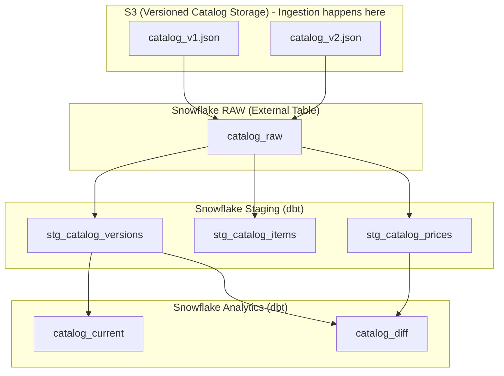

# Part 2 — Catalog Version Management & Analytics Integration

This document shows how to design a **lean, interview-ready solution** for catalog version tracking and analytics integration.  
We use **S3 + Snowflake + dbt** to simulate end-to-end change detection, version storage, and reporting.

---

## 1) The Catalog Problem

Caravelo's platform defines subscription plans (pricing, quotas, business rules) in a **Catalog JSON** stored in a NoSQL database.  
- Only one catalog is active at a time.  
- Updates are frequent (≈ 9 times/year).  
- **Critical Issue**: Catalog updates made directly to the NoSQL database do not generate events → analytics dashboards miss updates, creating a critical gap in our analytics data.

**The Challenge**: Design a comprehensive solution that enables catalog version tracking and analytics integration while maintaining the existing operational workflow, with near real-time change detection and support for complex nested JSON structures with dynamic schema variations.

**Our Solution Approach**:
1. **Bridge the gap** by capturing catalog versions from NoSQL owner
2. **Store versions** in S3 with change detection via content hashing
3. **Flatten JSON** into analytics-friendly tables using dbt
4. **Provide views** for current catalog + differences across versions

---

## 2) Example Catalog JSON

Here’s a simplified sample (two plans, one product):

```json
{
  "type": "SUBS_VERSIONED_CATALOG",
  "effectiveDate": "2025-07-01T00:00:00.000Z",
  "items": [
    {
      "name": "FA-RT5-ALL-MONTHLY-LAUNCH-PLAN",
      "prettyName": "Fly10More Club Launch offer",
      "visible": true,
      "product": "NETWORK-ALL-DOM-RT-5",
      "phases": [
        {
          "type": "EVERGREEN",
          "billingPeriod": "MONTHLY",
          "recurringPrice": { "prices": [ "ZAR 4000.00" ] }
        }
      ],
      "quota": { "limit": 10, "installments": 1, "installmentsFrequency": "MONTHS" }
    },
    {
      "name": "FA-RT5-ALL-MONTHLY-NEXT-PLAN",
      "prettyName": "Fly10More Club",
      "visible": false,
      "product": "NETWORK-ALL-DOM-RT-5",
      "phases": [
        {
          "type": "EVERGREEN",
          "billingPeriod": "MONTHLY",
          "recurringPrice": { "prices": [ "ZAR 4800.00" ] }
        }
      ],
      "quota": { "limit": 10, "installments": 1, "installmentsFrequency": "MONTHS" }
    }
  ],
  "products": [
    {
      "name": "NETWORK-ALL-DOM-RT-5",
      "prettyName": "Fly10More",
      "category": "Flight subscriptions",
      "type": "BASE",
      "network": "DOMESTIC",
      "tripType": "RT"
    }
  ],
  "currencies": [ "ZAR" ]
}
```

---

## 3) Step-by-Step Lean Solution

### Step 1 — S3 Ingestion & Change Detection

**The Problem**: Caravelo's NoSQL database contains the active catalog, but catalog updates don't generate events → analytics dashboards miss changes.

**The Solution**: Bridge the gap by capturing catalog versions from the NoSQL owner and storing them in S3 for analytics.

#### The NoSQL Owner Exposes Current Catalog
The NoSQL owner (or internal service) provides access to the current catalog via:
- **JSON Dump**: Direct database export
- **API Endpoint**: `GET /catalog/current` returning the active catalog JSON

#### Change Detection & Ingestion
A tiny uploader (manual command or 10-line Python job) that:

1. **Fetches** the current catalog JSON from NoSQL owner
2. **Canonicalizes** the JSON (sort keys for consistent formatting)
3. **Computes** SHA-256 hash of the canonicalized content
4. **Uploads** to S3 only if the hash is new (that's the change detector)

```bash
# Manual approach
aws s3 cp catalog_v1.json s3://caravelo-catalog/effective_date=2025-07-01/ts=2025-08-15T09:00:00Z/catalog_v1.json

# Python script approach
python upload_catalog.py --source="http://nosql-service/catalog/current" --bucket="caravelo-catalog"
```

**Versioning Strategy:**
- `effective_date`: Extracted from JSON `effectiveDate` field
- `ts`: Timestamp when the change was detected
- `hash`: Content-based versioning for change detection (prevents duplicates)

### Step 2 — Snowflake External Table Setup

Create external table pointing to S3 with partitioning by `effective_date`:

```sql
CREATE EXTERNAL TABLE catalog_raw_dbt (
    value VARIANT
)
LOCATION = @catalog_stage
FILE_FORMAT = (TYPE = JSON)
```

**Note**: `effective_date` comes from the JSON `effectiveDate` field, and `ts` is parsed from `METADATA$FILENAME` in the staging models.

### Step 3 — dbt Staging Models

We build **three staging models** to normalize the JSON.

#### a) `stg_catalog_versions.sql`  
One row per uploaded document.

```sql
SELECT
  value:type::string                 AS catalog_type,
  value:effectiveDate::timestamp_ntz AS effective_date,  -- From JSON effectiveDate field
  MD5(TO_VARCHAR(value))             AS catalog_hash,
  METADATA$FILENAME                  AS filename,
  TRY_TO_TIMESTAMP_NTZ(
    REGEXP_SUBSTR(METADATA$FILENAME, 'ts=([^/]+)\\/', 1, 1, 'e', 1)  -- Parse ts from filename
  )                                  AS detected_ts
FROM {{ source('raw','catalog_raw_dbt') }}
```

**Note**: `effective_date` comes from the JSON `effectiveDate` field, and `ts` is parsed from `METADATA$FILENAME` in the staging models.


#### b) `stg_catalog_items.sql` 
Flatten the items[] array.

```sql
WITH docs AS (
  SELECT value AS doc, MD5(TO_VARCHAR(value)) AS catalog_hash
  FROM {{ source('raw','catalog_raw_dbt') }}
)
SELECT
  d.catalog_hash,
  i.value:name::string       AS item_name,
  i.value:prettyName::string AS item_pretty_name,
  i.value:visible::boolean   AS visible,
  i.value:product::string    AS product_code,
  i.value:priceList::string  AS price_list,
  i.value:quota.limit::int   AS quota_limit,
  i.value:phases             AS phases  -- keep nested for price flattening
FROM docs d, LATERAL FLATTEN(input => d.doc:items) i
```

#### c) `stg_catalog_prices.sql` 
Normalize the nested prices (currency/amount).

```sql
WITH items AS (
  SELECT * FROM {{ ref('stg_catalog_items') }}
)
SELECT
  catalog_hash,
  item_name,
  p.value:billingPeriod::string AS billing_period,
  TRIM(SPLIT_PART(price.value::string, ' ', 1))  AS currency,
  TRY_TO_DECIMAL(TRIM(SPLIT_PART(price.value::string, ' ', 2)), 18, 2) AS amount
FROM items, LATERAL FLATTEN(input => phases) p,
     LATERAL FLATTEN(input => p.value:recurringPrice:prices) price
```
### Step 4 — Analytics Views

#### a) `catalog_current.sql`  
Get the most recent catalog.

```sql
WITH ranked AS (
  SELECT *,
         ROW_NUMBER() OVER (ORDER BY effective_date DESC, detected_ts DESC) AS rn
  FROM {{ ref('stg_catalog_versions') }}
)
SELECT *
FROM ranked
WHERE rn = 1
```

#### b) `catalog_diff.sql`  
Get the most recent catalog.

```sql
WITH v AS (
  SELECT catalog_hash, effective_date, detected_ts,
         ROW_NUMBER() OVER (ORDER BY effective_date DESC, detected_ts DESC) AS rn
  FROM {{ ref('stg_catalog_versions') }}
),
cur AS (SELECT catalog_hash FROM v WHERE rn = 1),
prev AS (SELECT catalog_hash FROM v WHERE rn = 2),
cur_p AS (SELECT * FROM {{ ref('stg_catalog_prices') }} WHERE catalog_hash IN (SELECT catalog_hash FROM cur)),
prev_p AS (SELECT * FROM {{ ref('stg_catalog_prices') }} WHERE catalog_hash IN (SELECT catalog_hash FROM prev))
SELECT
  COALESCE(c.item_name, p.item_name) AS item_name,
  p.amount AS previous_amount,
  c.amount AS current_amount,
  CASE
    WHEN c.amount IS NULL THEN 'REMOVED'
    WHEN p.amount IS NULL THEN 'ADDED'
    WHEN c.amount <> p.amount THEN 'CHANGED'
    ELSE 'UNCHANGED'
  END AS change_type
FROM cur_p c
FULL OUTER JOIN prev_p p
  ON c.item_name = p.item_name
 AND c.currency = p.currency
 AND c.billing_period = p.billing_period
 ```

 ## 5) Demo Outputs

Imagine two versions of the catalog:

- **v1**: `Fly10More Club` = 4800 ZAR  
- **v2**: same item but price increased to 5200 ZAR  

### `stg_catalog_prices` (flattened view)
| catalog_hash | item_name                      | billing_period | currency | amount |
|--------------|--------------------------------|----------------|----------|--------|
| h1           | FA-RT5-ALL-MONTHLY-LAUNCH-PLAN | MONTHLY        | ZAR      | 4000   |
| h1           | FA-RT5-ALL-MONTHLY-NEXT-PLAN   | MONTHLY        | ZAR      | 4800   |
| h2           | FA-RT5-ALL-MONTHLY-LAUNCH-PLAN | MONTHLY        | ZAR      | 4000   |
| h2           | FA-RT5-ALL-MONTHLY-NEXT-PLAN   | MONTHLY        | ZAR      | 5200   |

---

### `catalog_current` (only latest)
| catalog_hash | effective_date | detected_ts          |
|--------------|----------------|----------------------|
| h2           | 2025-07-01     | 2025-08-15T09:00:00Z |

---

### `catalog_diff` (change detection)
| item_name                      | previous_amount | current_amount | change_type |
|--------------------------------|-----------------|----------------|-------------|
| FA-RT5-ALL-MONTHLY-NEXT-PLAN   | 4800            | 5200           | CHANGED     |
| FA-RT5-ALL-MONTHLY-LAUNCH-PLAN | 4000            | 4000           | UNCHANGED   |

---

## 6) Why This Works

- **Simple**: Runs with just S3 + Snowflake + dbt (your free-tier setup).  
- **Extensible**: Easy to add EventBridge/Lambda for automation later.  
- **Schema evolution**: Snowflake `VARIANT` + dbt flattening handle nested, changing JSON.  
- **Analytics ready**: `catalog_current` and `catalog_diff` tables can power dashboards or alerts.

**Production Note**: In production, this manual/script ingestion would be replaced by **EventBridge + Lambda** writing to S3 only on change, providing automated, event-driven catalog versioning.  

---

## 7) Architecture Diagram



## 8) Key Takeaway

This lean demo shows the full lifecycle:

1. Upload catalog versions to S3 with versioning in filenames.
2. Expose them to Snowflake as VARIANT data via external tables.
3. Flatten into normalized staging tables with dbt.
4. Build catalog_current and catalog_diff for real-time insights.

It proves that Caravelo’s analytics gap can be closed without overengineering, while leaving room for a future AWS-native automation layer.

## 9) Next Steps — Production Setup

The demo solution is intentionally lean for the interview.  
In a **production setup**, Caravelo could extend it as follows:

- **Event-Driven Ingestion**  
  Replace manual/script ingestion with **EventBridge + Lambda** that writes to S3 only on change.  
  The Lambda can validate the file, compute hash, and only upload if content changed, providing automated, event-driven catalog versioning.

- **Schema Evolution Management**  
  Register JSON schemas in **AWS Glue Schema Registry** or handle schema drift with dbt macros that automatically detect new fields.

- **Real-Time Updates**  
  Instead of relying on batch dbt runs, enable **Snowpipe** on S3 → Snowflake for near-real-time ingestion of new catalogs.

- **Data Quality & Auditing**  
  Add dbt tests for:  
  - Not null on `catalog_hash`, `item_name`  
  - Uniqueness on `(catalog_hash, item_name)`  
  - Valid currency codes (ISO 4217 list)

- **Alerting on Changes**  
  Integrate the `catalog_diff` output with **Slack alerts** (via AWS Lambda or dbt Cloud webhooks) to notify when prices or quotas change.

- **Cost & Governance**  
  - Archive historical JSONs to an S3 Glacier tier for low-cost retention.  
  - Tag datasets with catalog version + airline to ensure clear tenant separation.  

This ensures the solution is **scalable, governed, and production-ready**, while still following the **AWS-native, event-driven pattern** Caravelo expects.
